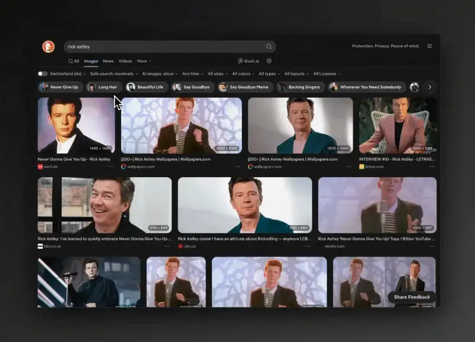

<div align="center">


# Annotate

**Take a screenshot, click to add notes, copy it.**<br>
Lives in the menu bar on macOS and the system tray on Windows.<br>
Free and offline. No account, nothing uploaded.

[](Cargo.toml)
[](#install)
[](LICENSE)
[](https://github.com/noelcserepy/annotate/releases/latest)

[](https://github.com/noelcserepy/annotate/releases/latest)

[Install](#install) · [Keys](#keys) · [Report a bug](https://github.com/noelcserepy/annotate/issues)

<br>



</div>

## How it works

1. Press Cmd+Shift+4 (Ctrl+Shift+4 on Windows) and drag over part of the screen.
2. Click where you want a note.
3. Type.
4. Press Cmd+C (Ctrl+C). The screenshot with your notes is now on the clipboard.

## Keys

| Action | macOS | Windows |
| --- | --- | --- |
| Capture, from any app | Cmd+Shift+4 | Ctrl+Shift+4 |
| Callout | Click a spot, or drag a box around something | same |
| Arrow | Hold A and drag | same |
| Rectangle | Hold R and drag | same |
| Delete selected | Backspace | Backspace |
| Undo | Cmd+Z | Ctrl+Z |
| Copy and close | Cmd+C | Ctrl+C |
| Save and close | Cmd+S | Ctrl+S |
| Close | Esc | Esc |

Settings lets you record a different shortcut for each of these.

## What else it does

- The tray menu lists your last five captures. Click one to reopen it with its annotations, still editable.
- Settings changes the colours, font, text size and line width, with a live preview. Each capture keeps the style it was taken with.
- Save and close writes a PNG to your Downloads folder, or whichever folder you pick.
- Copied images carry their DPI, so a retina capture pastes at its on-screen size.
- Annotate starts at login. You can turn that off in Settings.

Everything stays on your machine. Captures live in `~/Library/Application Support/Annotate/history` on macOS and `%APPDATA%\Annotate\history` on Windows, each in its own folder with the original PNG and a `doc.json` of the annotations.

## Install

Download the zip for your OS from [Releases](https://github.com/noelcserepy/annotate/releases/latest). The builds aren't signed with a paid Apple or Microsoft certificate, so both systems warn you the first time.

### macOS 13+

Unzip `Annotate-macos.zip` and move `Annotate.app` to Applications. When you open it, macOS says it can't verify the developer. Open System Settings > Privacy & Security, scroll down, and click Open Anyway. Or skip the dialog from Terminal:

```sh
xattr -dr com.apple.quarantine /Applications/Annotate.app
```

macOS asks for Screen Recording permission on the first capture, because Annotate captures with `screencapture -i`. It asks again after every update, since each build has a new signature.

### Windows 10/11

Unzip `Annotate-windows.zip` and put `annotate.exe` somewhere it can stay, like `%LOCALAPPDATA%\Programs\Annotate`. Start at login points at that path. When you run it, SmartScreen says "Windows protected your PC". Click More info, then Run anyway.

The icon sits in the system tray, possibly behind the `^` arrow.

Linux isn't supported.

### Build from source

You need Rust 1.90 or newer.

On macOS you also need the Xcode command line tools (`xcode-select --install`). `scripts/bundle.sh install` builds `Annotate.app`, moves it to /Applications and starts it. To keep Screen Recording permission across rebuilds, create a code signing certificate in Keychain Access (Certificate Assistant > Create a Certificate, type Code Signing) and set `ANNOTATE_SIGN_IDENTITY` to its name. Without it, `bundle.sh` signs ad-hoc.

On Windows you need the MSVC toolchain, which the Rust installer offers to set up. Run `cargo build --release` and take `target\release\annotate.exe`.

## Issues

Found a bug or want a feature? [Open an issue](https://github.com/noelcserepy/annotate/issues). I don't accept pull requests.

## License

MIT, see [LICENSE](LICENSE). The bundled Inter font is under the SIL Open Font License, see [assets/Inter-LICENSE.txt](assets/Inter-LICENSE.txt).
